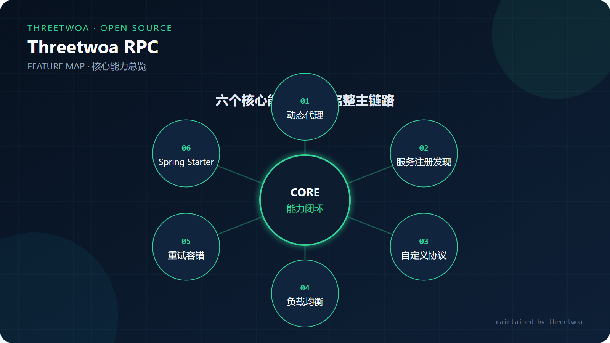
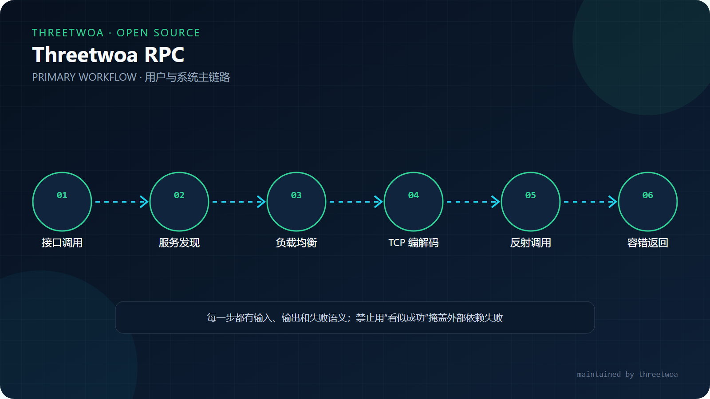
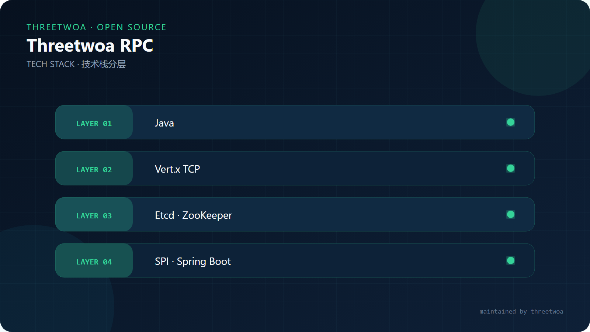
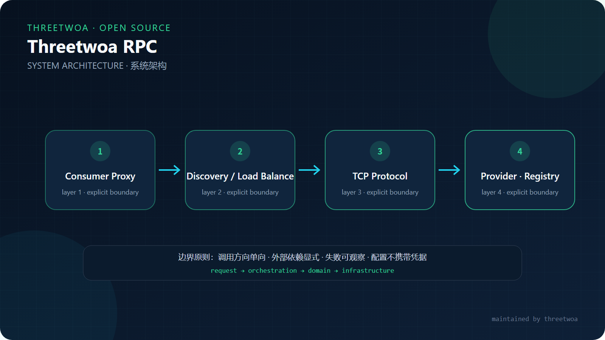
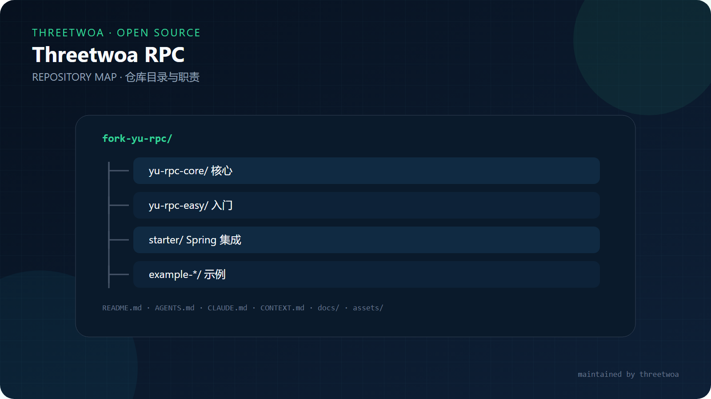

<p align="center">
  <h1 align="center">Threetwoa RPC</h1>
  <p align="center"><em>一个可扩展、可观察的 Java RPC 学习与实践框架</em></p>
  <p align="center">覆盖服务注册发现、动态代理、序列化、负载均衡、重试容错、自定义协议与 Spring Boot Starter。</p>
</p>

<p align="center"></p>

<p align="center">
  
  
  
</p>

<p align="center"><a href="#功能">功能</a> · <a href="#快速开始">快速开始</a> · <a href="#架构">架构</a> · <a href="#模块">模块</a> · <a href="#扩展点">扩展点</a></p>

---

## 为什么需要这个框架

它把一次 Java 方法调用拆解为可阅读、可替换的 RPC 流水线，适合验证框架设计和分布式通信机制。当前边界是学习与二次开发：不承诺生产级治理、跨语言协议兼容或多租户隔离。

## 功能

<p align="center"></p>

| 能力 | 实现 |
|---|---|
| 服务调用 | JDK 动态代理将接口调用转换为 RPC 请求 |
| 注册发现 | 本地注册表、Etcd 与 ZooKeeper |
| 传输协议 | Vert.x TCP、自定义消息头、半包粘包处理 |
| 扩展机制 | 键值型 SPI，用户扩展优先于系统默认实现 |
| 流量治理 | 随机、轮询、一致性哈希负载均衡 |
| 稳定性 | 重试策略与 fail-fast / fail-safe / fail-over / fail-back 容错 |
| Spring 集成 | 注解、自动装配与 Starter |

## 主链路

<p align="center"></p>

## 快速开始

```bash
git clone https://github.com/Aafff623/fork-yu-rpc.git
cd fork-yu-rpc
mvn clean install
```

先启动 example-provider，再运行 example-consumer。Spring Boot 示例位于对应的 springboot-provider / springboot-consumer 模块。

## 技术栈

<p align="center"></p>

## 架构

<p align="center"></p>

```text
Consumer Interface → Dynamic Proxy → Service Discovery → Load Balancer
  → Retry → TCP Protocol → Provider Reflection Call
  → Response Decode → Tolerant Strategy → Consumer Result
```

## 模块

<p align="center"></p>

| 模块 | 职责 |
|---|---|
| yu-rpc-core | 配置、协议、传输、注册中心、SPI 与治理策略 |
| yu-rpc-easy | 最小化入门实现 |
| yu-rpc-spring-boot-starter | Spring Boot 自动装配与注解 |
| example-common | 消费者和提供者共享契约 |
| example-provider / consumer | 原生调用示例 |
| example-springboot-* | Spring Boot 集成示例 |

## 扩展点

在 META-INF/rpc/custom/ 下用“key=实现类全名”注册自定义序列化器、注册中心、负载均衡、重试或容错实现。自定义目录后加载，因此同名 key 会覆盖系统默认值。

## 阅读顺序

1. RpcApplication 与 RpcConfig
2. ServiceProxy
3. ProtocolMessageEncoder / Decoder
4. VertxTcpClient / TcpServerHandler
5. SpiLoader 与各 Factory
6. Starter bootstrap 与 examples

## 原始资料画册

| 框架结构 | 教程资料 |
|:---:|:---:|
| [](docs/structure.jpg) | [](docs/tutorial.jpg) |

## 视觉画册

点击缩略图可查看原始矢量图：

| | |
|:---:|:---:|
| [](assets/images/readme/features.svg)<br>**Features** · 核心能力 | [](assets/images/readme/architecture.svg)<br>**Architecture** · 系统边界 |
| [](assets/images/readme/tech-stack.svg)<br>**Tech Stack** · 技术分层 | [](assets/images/readme/workflow.svg)<br>**Workflow** · 主链路 |
| [](assets/images/readme/structure.svg)<br>**Structure** · 仓库地图 | |


## Preview

本仓为单产品应用，**不单独建设 Preview 资产站**（无组件 Gallery / demo 墙）。本地浏览 README 排版请用预览壳：

```bash
python -m http.server 4316
# http://127.0.0.1:4316/preview-readme.html
```

> `preview-shell.png`：本仓声明省略（无 Preview 站可截）。

## Showcase

推荐主链路：接口调用 → 动态代理 → 服务发现 → 负载均衡 → 重试 → TCP 编解码 → 反射调用 → 容错

真机截图槽位（待 Playwright 补齐）：

| 槽位 | 文件 | 状态 |
|---|---|---|
| 入口 / 主界面 | `assets/images/readme/showcase-01.png` | 占位 |
| 核心流程 | `assets/images/readme/showcase-02.png` | 占位 |
| 结果 / 交付 | `assets/images/readme/showcase-03.png` | 占位 |

## 仓库结构

```text
fork-yu-rpc/
├── yu-rpc-core/                  # 协议、注册、负载、容错
├── yu-rpc-easy/                  # 最小实现
├── yu-rpc-spring-boot-starter/   # Spring 集成
├── example-*/                    # 示例与集成测试
├── docs/agents|adr|glossary|knowledge|outputs/
├── assets/images/readme/
├── AGENTS.md · CLAUDE.md · CONTEXT.md · LANGUAGES.md
└── preview-readme.{html,css,js}  # 端口 4316
```

## Key docs

| 文档 | 说明 |
|---|---|
| [CONTEXT.md](CONTEXT.md) | 领域事实与边界 |
| [LANGUAGES.md](LANGUAGES.md) | 共享用词 |
| [AGENTS.md](AGENTS.md) | Agent 硬约束 |
| [docs/agents/workflow.md](docs/agents/workflow.md) | 任务流 |
| [docs/outputs/prd/readme-diagrams/](docs/outputs/prd/readme-diagrams/) | README 配图 brief / prompts |
| [assets/README.md](assets/README.md) | 媒体约定 |

## 维护者

原作者：**李鱼皮（[liyupi](https://github.com/liyupi)）**。二次开发维护者：[threetwoa](https://github.com/threetwoa)。上游项目为 [liyupi/yu-rpc](https://github.com/liyupi/yu-rpc)，许可证以 LICENSE 及上游版权声明为准。
